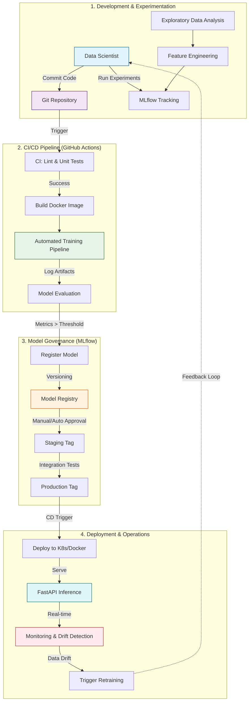

# Telco Customer Churn Prediction

<div align="center">
  
  <h3>Powered by Kavi.ai</h3>
</div>

[](https://www.python.org/downloads/)
[](https://opensource.org/licenses/MIT)

A production-ready machine learning solution for predicting customer churn in the telecom industry using XGBoost, FastAPI, and MLflow.

## Table of Contents

- [Features](#features)
- [Quick Start](#quick-start)
- [Installation](#installation)
- [Usage](#usage)
- [Project Structure](#project-structure)
- [API Documentation](#api-documentation)
- [Deployment](#deployment)
- [Contributing](#contributing)
- [License](#license)

## Features

- ✅ **Data Quality Validation** - Great Expectations integration
- ✅ **Feature Engineering** - Automated preprocessing pipeline
- ✅ **Model Training** - XGBoost with optimized hyperparameters
- ✅ **Experiment Tracking** - MLflow for metrics and model versioning
- ✅ **REST API** - FastAPI with automatic OpenAPI documentation
- ✅ **Web UI** - Gradio interface for interactive predictions
- ✅ **Containerization** - Docker for consistent deployment
- ✅ **CI/CD** - GitHub Actions for automated builds

## MLOps Lifecycle



## Quick Start

```bash
# 1. Install dependencies
make install

# 2. Verify data exists
make check-data

# 3. Train model
make train

# 4. Save model to MLflow registry
make save-model

# 5. Start API server
make serve
```

**Access:**
- API: http://localhost:8000
- Docs: http://localhost:8000/docs
- UI: http://localhost:8000/ui

## Installation

### Prerequisites

- Python 3.11+
- Docker (optional)
- Git (optional)

### Setup

```bash
# Clone repository
git clone <repository-url>
cd Telco-Customer-Churn-ML

# Create virtual environment
python -m venv venv
source venv/bin/activate  # On Windows: venv\Scripts\activate

# Install dependencies
make install

# Verify data exists
make check-data
```

## Usage

### Training Pipeline

```bash
# Train model (saves to MLflow)
make train

# Evaluate model (logs metrics to MLflow)
make eval

# Save model to registry
make save-model

# Promote model to Production
make promote-model
```

### API Server

```bash
# Start server locally
make serve

# Or with uvicorn directly
uvicorn src.app.main:app --host 0.0.0.0 --port 8000 --reload
```

### MLflow

```bash
# View experiments
make mlflow-ui
# Open http://localhost:5000
```

## Project Structure

```
telco-customer-churn-ml/
├── src/                    # Source code
│   ├── app/               # FastAPI application
│   ├── data/              # Data loading & preprocessing
│   ├── features/          # Feature engineering
│   ├── serving/           # Model serving
│   └── utils/             # Utilities
├── scripts/                # Pipeline scripts
│   ├── run_pipeline.py    # Training pipeline
│   ├── evaluate_model.py # Model evaluation
│   ├── promote_model.py   # Model promotion
│   └── get_latest_run.py  # MLflow utilities
├── tests/                  # Test suite
├── data/                   # Data directory
│   ├── raw/              # Raw data
│   └── processed/       # Processed data
├── config/                # Configuration files
├── notebooks/             # Jupyter notebooks
├── Makefile              # Workflow commands
├── Dockerfile            # Container configuration
└── requirements.txt      # Dependencies
```

## API Documentation

### Endpoints

- `GET /` - Health check
- `POST /predict` - Churn prediction
- `GET /docs` - Swagger UI documentation
- `GET /redoc` - ReDoc documentation
- `GET /ui` - Gradio web interface

### Example Request

```bash
curl -X POST "http://localhost:8000/predict" \
  -H "Content-Type: application/json" \
  -d '{
    "gender": "Male",
    "Partner": "Yes",
    "Dependents": "No",
    "PhoneService": "Yes",
    "MultipleLines": "No",
    "InternetService": "DSL",
    "OnlineSecurity": "Yes",
    "OnlineBackup": "No",
    "DeviceProtection": "No",
    "TechSupport": "No",
    "StreamingTV": "No",
    "StreamingMovies": "No",
    "Contract": "Two year",
    "PaperlessBilling": "No",
    "PaymentMethod": "Mailed check",
    "tenure": 72,
    "MonthlyCharges": 20.0,
    "TotalCharges": 1440.0
  }'
```

## Deployment

### Docker

**Docker Hub:** `machhakiran0108/telco-churn-ml:latest`

```bash
# Build image
make docker-build

# Push to Docker Hub
make docker-push

# Pull and run
make docker-pull
make docker-inference
```

### GitHub Actions

Automated CI/CD pipeline:
- Runs tests on push/PR
- Builds Docker image
- Pushes to Docker Hub

See [.github/SETUP.md](.github/SETUP.md) for configuration.

## Contributing

1. Fork the repository
2. Create a feature branch
3. Make your changes
4. Submit a pull request

## License

This project is licensed under the MIT License - see the [LICENSE](LICENSE) file for details.

## Contact

- **GitHub:** [machhakiran](https://github.com/machhakiran)
- **Docker Hub:** [machhakiran0108](https://hub.docker.com/u/machhakiran0108)
