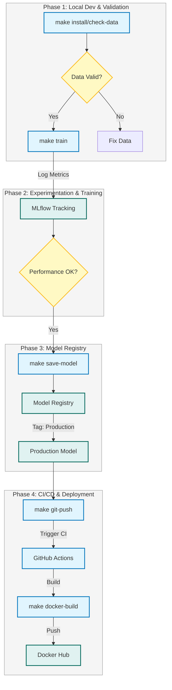

# Telco Customer Churn Prediction

<div align="center">
  
  <h3>Powered by Kavi.ai</h3>
</div>

[](https://www.python.org/downloads/)
[](https://opensource.org/licenses/MIT)

A production-ready machine learning solution for predicting customer churn in the telecom industry using XGBoost, FastAPI, and MLflow.

**Repository:** [https://github.com/machhakiran/mlops-lifecyccle-prod-project](https://github.com/machhakiran/mlops-lifecyccle-prod-project)


## Features

- ✅ **Data Quality Validation** - Great Expectations integration
- ✅ **Feature Engineering** - Automated preprocessing pipeline
- ✅ **Model Training** - XGBoost with optimized hyperparameters
- ✅ **Experiment Tracking** - MLflow for metrics and model versioning
- ✅ **REST API** - FastAPI with automatic OpenAPI documentation
- ✅ **Web UI** - Premium Kavi.ai branded interface for interactive predictions
- ✅ **Containerization** - Docker for consistent deployment
- ✅ **CI/CD** - GitHub Actions for automated builds

## 🚀 MLOps Lifecycle: Path to Production

This project follows a strict MLOps pipeline to ensure high-quality model deployment. The diagram below illustrates how code and data evolve from local development to production.



### Note on Production Promotion
1.  **Data Validation**: Great Expectations ensures no bad data enters the training pipeline.
2.  **Training & Evaluation**: XGBoost trains the model. Metrics are logged to MLflow.
3.  **Registry**: Only models that pass manual or automated evaluation are promoted to the **MLflow Registry**.
4.  **Containerization**: **Docker** ensures the model runs the same way in production as it does locally.
5.  **CI/CD**: Pushing to `main` triggers valid build and test pipelines.

## Setup & Installation

### 1. Verification of Prerequisites
Ensure you have the following installed:
- Python 3.11+
- Docker (optional but recommended)
- Git

### 2. Clone & Install
```bash
# Clone repository
git clone https://github.com/machhakiran/mlops-lifecyccle-prod-project
cd mlops-lifecyccle-prod-project

# Create virtual environment
python -m venv venv
source venv/bin/activate  # On Windows: venv\Scripts\activate

# Install dependencies
make install

# Verify data integrity
make check-data
```

### 3. Verification Full URL
After starting the server (`make serve`), verify the endpoints using the full URLs below:

**Kavi.ai UI (Interactive):**
- **URL:** `http://localhost:8000/ui`
- **Description:** Premium branded interface for real-time predictions.

**Inference Endpoint:**
- **URL:** `http://localhost:8000/predict`
- **Method:** `POST`
- **Docs:** `http://localhost:8000/docs`

**Model Evaluation (MLflow):**
- **URL:** `http://localhost:5000` (MLflow UI)
- **Curls for Testing:**
    ```bash
    curl -X POST "http://localhost:8000/predict" \
      -H "Content-Type: application/json" \
      -d '{"gender": "Male", "Partner": "Yes", "Dependents": "No", "PhoneService": "Yes", "MultipleLines": "No", "InternetService": "DSL", "OnlineSecurity": "Yes", "OnlineBackup": "No", "DeviceProtection": "No", "TechSupport": "No", "StreamingTV": "No", "StreamingMovies": "No", "Contract": "Two year", "PaperlessBilling": "No", "PaymentMethod": "Mailed check", "tenure": 72, "MonthlyCharges": 20.0, "TotalCharges": 1440.0}'
    ```

## Usage

### Full MLOps Workflow
Run the following commands in the sequence below:

```bash
# 1. Install all dependencies
make install

# 2. Verify data integrity
make check-data

# 3. Start MLflow Tracking Server (Open in new terminal)
make mlflowrun
# View at: http://localhost:5000

# 4. Train XGBoost model & log to MLflow
make train

# 5. Register best model in MLflow Registry
make save-model

# 6. Start Kavi.ai App for Local Testing (Open in new terminal)
make uirun
# View at: http://localhost:8000/ui

# 7. Commit & Push to GitHub
make git-push
```

### Utilities

```bash
# Clean workspace
make clean
```

## Project Structure

```
telco-customer-churn-ml/
├── src/                    # Source code
│   ├── app/               # FastAPI application & Gradio UI
│   ├── data/              # Data loading & preprocessing
│   ├── features/          # Feature engineering
│   ├── serving/           # Model serving logic
│   └── utils/             # Utilities (Validation, etc.)
├── scripts/                # Pipeline orchestration scripts
│   ├── run_pipeline.py    # Main training pipeline
│   ├── promote_model.py   # MLflow model registry logic
│   └── get_latest_run.py  # MLflow helper utilities
├── tests/                  # Integration and Unit tests
├── data/                   # Data versioning directory
│   ├── raw/              # Raw CSV data
│   └── processed/       # Preprocessed datasets
├── config/                # Environment configuration
├── notebooks/             # Exploratory Data Analysis
├── Makefile              # MLOps workflow automation
├── Dockerfile            # Containerization manifest
└── requirements.txt      # Project dependencies
```

## API Documentation

### Endpoints

- `GET /` - Health check
- `POST /predict` - Churn prediction
- `GET /docs` - Swagger UI documentation
- `GET /redoc` - ReDoc documentation
- `GET /ui` - Gradio web interface

### Example Request

```bash
curl -X POST "http://localhost:8000/predict" \
  -H "Content-Type: application/json" \
  -d '{
    "gender": "Male",
    "Partner": "Yes",
    "Dependents": "No",
    "PhoneService": "Yes",
    "MultipleLines": "No",
    "InternetService": "DSL",
    "OnlineSecurity": "Yes",
    "OnlineBackup": "No",
    "DeviceProtection": "No",
    "TechSupport": "No",
    "StreamingTV": "No",
    "StreamingMovies": "No",
    "Contract": "Two year",
    "PaperlessBilling": "No",
    "PaymentMethod": "Mailed check",
    "tenure": 72,
    "MonthlyCharges": 20.0,
    "TotalCharges": 1440.0
  }'
```

## Deployment

### Docker

**Docker Hub:** `machhakiran0108/telco-churn-ml:latest`

### Sequence Started (Post-Code Push)

```bash
# 8. Build production Docker image
make docker-build

# 9. Push image to Docker Hub
make docker-push

# 10. Pull image (on deployment server)
make docker-pull

# 11. Run containerized inference server
make docker-inference
# Verifies: http://localhost:8000/ui
```

### GitHub Actions

Automated CI/CD pipeline:
- Runs tests on push/PR
- Builds Docker image
- Pushes to Docker Hub

See [.github/SETUP.md](.github/SETUP.md) for configuration.

## Contributing

1. Fork the repository
2. Create a feature branch
3. Make your changes
4. Submit a pull request

## License

This project is licensed under the MIT License - see the [LICENSE](LICENSE) file for details.

## Contact

- **GitHub:** [machhakiran](https://github.com/machhakiran)
- **Docker Hub:** [machhakiran0108](https://hub.docker.com/u/machhakiran0108)

---

## Author

**Machha Kiran**
*MLOps Engineer | AI Solutions Architect*

---
© 2026 Kavi.ai - Accelerated Machine Learning Operations
